<!-- ╔══════════════════════════════════════════════════════════════╗ -->
<!-- ║   untitleDdev · animated profile README                       ║ -->
<!-- ║   Theme: cyberpunk / hacker-green. Local art: banner.svg,     ║ -->
<!-- ║   hud.svg, divider.svg (animated SVG — works on GitHub).      ║ -->
<!-- ╚══════════════════════════════════════════════════════════════╝ -->

<div align="center">

<!-- ░░ Animated wave header ░░ -->


<!-- ░░ Animated terminal banner (local SVG) ░░ -->


<br/>

<!-- ░░ Typing animation ░░ -->
<a href="https://untitleddev-portfolio.vercel.app/">
  
</a>

<br/><br/>

<!-- ░░ Status badges ░░ -->


<br/><br/>

<!-- ░░ Social ░░ -->
<a href="https://untitleddev-portfolio.vercel.app/"></a>
<a href="https://www.linkedin.com/in/ahmed940"></a>
<a href="https://github.com/untitledDev9"></a>

</div>


## ⚡ `whoami`

I build products that solve real problems — from **device-security platforms** to **business-verification tools**. My work spans the full stack: product design, frontend, backend, mobile, APIs, and database architecture.

Currently founding **GadgetVault** and building **CheckAm**, while leading development teams and shipping production applications across React Native and the web.

```ts
const untitleDdev = {
  role:     "Full-Stack Developer & Founder",
  company:  "GadgetVault",
  location: "Nigeria 🇳🇬",
  focus:    ["mobile + web that scales", "clean architecture", "real-world impact"],
  ownsEndToEnd: "design → frontend → backend → mobile → APIs → db",
  learning: "B.Sc. Computer Science @ NOUN",
  motto:    "Turning ideas into real products.",
};
```


## 🎮 Operator Dossier

<div align="center">

<!-- ░░ Game-style HUD / skill sheet (local animated SVG) ░░ -->


<!-- 🎯 Want a Call of Duty / gaming GIF here too? Drop your own GIF URL below
     (kept commented so the README never ships a broken image):

-->

</div>


## 🧩 Current Missions

<table>
<tr>
<td width="50%" valign="top">

### 🛡️ GadgetVault — *Founder*

A platform that helps people **verify and protect their devices**: IMEI checking, device verification, lost-and-stolen reporting, and tools that let buyers avoid stolen phones and vendors verify devices before purchase.

> Owning product design, frontend, backend, mobile, API design & database architecture.

</td>
<td width="50%" valign="top">

### ✅ CheckAm

A **business-verification platform** that helps users confirm the legitimacy of businesses and build trust online.

> Helping people transact with confidence and avoid scams.

</td>
</tr>
</table>


## 🛠️ Tech Arsenal

<div align="center">

**Frontend & Mobile**


**Backend & Data**


**Cloud & Tooling**


</div>


## 📊 War Room — GitHub Stats

<div align="center">


<br/>


<br/>


<br/>


<br/>

<!-- ░░ Contribution snake — generated by the GitHub Action in .github/workflows/snake.yml.
     Appears after the workflow runs once (Actions → "Generate Snake" → Run workflow). ░░ -->
<picture>
  <source media="(prefers-color-scheme: dark)" srcset="https://raw.githubusercontent.com/untitledDev9/untitledDev9/output/github-contribution-grid-snake-dark.svg" />
  <source media="(prefers-color-scheme: light)" srcset="https://raw.githubusercontent.com/untitledDev9/untitledDev9/output/github-contribution-grid-snake.svg" />
  
</picture>

</div>


## 🧭 Experience &nbsp;·&nbsp; 🎓 Education

| Role | Where | When |
|------|-------|------|
| **Founder & Software Developer** | GadgetVault | Sep 2025 – Present |
| **Dev Team Lead** | Stainless Technology | Mar 2025 – Dec 2025 |
| **Frontend Developer** | Renbo Studio | May 2024 – Nov 2024 |
| 🎓 **B.Sc. Computer Science** | National Open University of Nigeria | Sep 2025 – Present |
| 🎓 **National Diploma, Computer Science** | Lagos State Polytechnic | Sep 2021 – Oct 2024 |


<div align="center">

## 🤝 Let's Build Something

I'm open to collaboration, freelance work, and conversations about building good software.

<a href="https://untitleddev-portfolio.vercel.app/"></a>
<a href="https://www.linkedin.com/in/ahmed940"></a>
<a href="https://github.com/untitledDev9"></a>

<br/><br/>

<i>⭐ Turning ideas into real products.</i>

</div>


